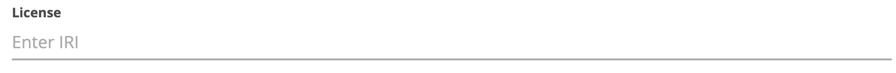

Detail: License
---


The semantics for this field is defined in [DCAT](https://www.w3.org/TR/vocab-dcat-2/#Property:resource_license) and is described as follows:

_A legal document under which the resource is made available._

This field is related to the previous, access, however where the access field describes who can access the resource, the license field describes under which conditions the catalog can be accessed.
In the example of Wikidata the license for the catalog in this FDP is set at CC0.

However, both the values for both access and license can be different. E.g. we can describe the metadata using a public license, while
defining the access rights to the data to be restricted to a specific group of people.

In the case of Wikidata, we will stick to the set license, which is a public license. As such, we will use the following value for this field:

```http://www.wikidata.org/entity/Q6938433```

Providers of URIs for licenses are scattered across the web in future versions of this documents we will list other examples below.