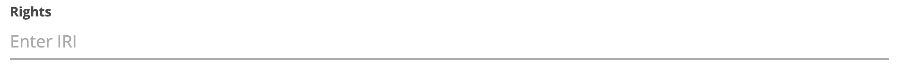

Detail: Rights
---


The semantics for this field is defined in [DCAT](https://www.w3.org/TR/vocab-dcat-2/#Property:resource_access_rights) and is described as follows:

_Information about who can access the resource or an indication of its security status._

Wikidata is a public data resource which implies that everyone can access it. As such, we will use the following value for this field:

```http://www.wikidata.org/entity/Q6938433```

Providers of URIs for access rights are scattered across the web and a bit challenging to navigate. A nice example of a list of URIs for access rights is 
the listed access rights of the [EU Vocabularies](https://op.europa.eu/en/web/eu-vocabularies/concept-scheme/-/resource?uri=http://publications.europa.eu/resource/authority/access-right). While the definitions might resonate well with the access rights of your data resource, this vocabulary is geared towards
use in the context of EU publications. We are listing it, because it provides a nice example in case a resource wants to define its 
own access rights.

# Possible vocabularies on access rights
## EU Vocabularies
The EU Vocabularies are a collection of vocabularies that are used in the context of EU publications. The following access rights are defined

| Label        | URI             |
|--------------|-----------------|
| CONFIDENTIAL | http://publications.europa.eu/resource/authority/access-right/CONFIDENTIAL |
| NON_PUBLIC   | http://publications.europa.eu/resource/authority/access-right/NON_PUBLIC |
| PUBLIC       | http://publications.europa.eu/resource/authority/access-right/PUBLIC |
| RESTRICTED   | http://publications.europa.eu/resource/authority/access-right/RESTRICTED |
| SENSITIVE       | http://publications.europa.eu/resource/authority/access-right/SENSITIVE |


